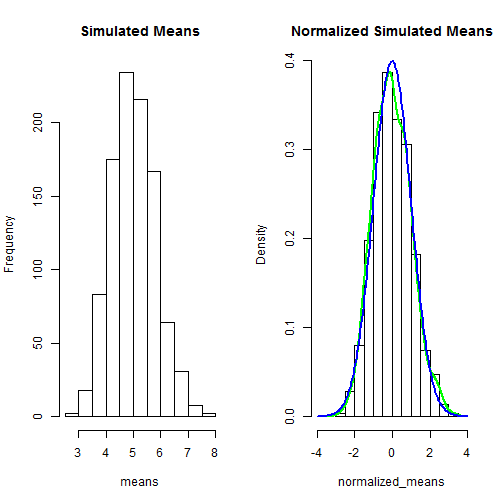

Coursera Data Science Specialization
========================================================
Statistical Inference Course Project
========================================================

This is the project for the Statistical Inference course within Coursera's Data Science Specialization. Simulation will be used to explore inference and conduct simple inferential data analysis. The project consists of 2 parts:

1. Simulation Exercises
2. Basic Inferential Data Analysis

Part 1: Simulation Exercises
--------------------------------------------------------

The exponential distribution can be simulated with rexp(n, lambda) where lambda is the rate parameter. The mean of an exponential distribution is 1/lambda and the standard deviation is also 1/lambda. 

Lambda=0.2 for all simulations. 1,000 samples of 40 exponential random variables will be simulated. 

Find the mean and variance of the simulated distribution.


```r
nosim <- 1000
n <- 40
lambda <- 0.2
set.seed(23)

variables <- matrix(rexp(nosim*n, lambda), nosim)
means <- apply(variables, 1, mean)
sim_avg <- mean(means)
sim_sd <- sd(means)
```

Calculate the theoretical center and variance of the distribution. Compare with the simulated center and variance.


```r
compare <- matrix(c(sim_avg, sim_sd^2, 1/lambda, (1/lambda)^2/n), 2)
rownames(compare) = c("mean", "variance")
colnames(compare) = c("simulated", "theoretical")
compare
```

```
##          simulated theoretical
## mean        5.0142       5.000
## variance    0.6355       0.625
```

Show that the distribution is approximately normal. The first histogram shows the distribution of the simulated means. The histogram with a green line shows the distribution of the normalized simulated means. Lastly, blue line shows a standard normal distribution.The overlap of the green and blue lines shows that the simulated distribution is approximately normal.


```r
par(mfrow = c(1,2))
hist(means, main="Simulated Means")
normalized_means <- (means - sim_avg) / sim_sd
hist(normalized_means, prob=TRUE, xlim=c(-4, 4), main="Normalized Simulated Means")
lines(density(normalized_means), lwd=2, col="green")

x=seq(-4, 4, length=200)
y=1/sqrt(2*pi)*exp(-x^2/2)
lines(x, y, type="l", lwd=2, col="blue")
```

 

Determine the 95% confidence interval for 1/lambda.


```r
conf_int <- (sim_avg + c(-1, 1)*qnorm(0.975)*sim_sd/sqrt(n))
conf_int
```

```
## [1] 4.767 5.261
```


Evaluate the coverage of the 95% confidence interval for 1/lambda.


```r
stdev <- apply(variables, 1, sd)
lower <- sim_avg - qnorm(0.975)*stdev/sqrt(n)
upper <- sim_avg + qnorm(0.975)*stdev/sqrt(n)
coverage <- mean(lower < 1/lambda & upper > 1/lambda)
coverage
```

```
## [1] 1
```


