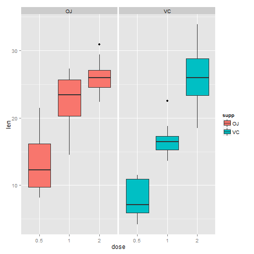

Coursera Data Science Specialization
========================================================
Statistical Inference Course Project
========================================================

This is the project for the Statistical Inference course within Coursera's Data Science Specialization. Simulation will be used to explore inference and conduct simple inferential data analysis. The project consists of 2 parts:

1. Simulation Exercises
2. Basic Inferential Data Analysis

Part 2: Basic Inferential Data Analysis
--------------------------------------------------------

The ToothGrowth data in the R datasets package will be used to conduct basic inferential data analysis.

Load the dataset and perform basic exploratory data analyses.


```r
data(ToothGrowth)
str(ToothGrowth)
```

```
## 'data.frame':	60 obs. of  3 variables:
##  $ len : num  4.2 11.5 7.3 5.8 6.4 10 11.2 11.2 5.2 7 ...
##  $ supp: Factor w/ 2 levels "OJ","VC": 2 2 2 2 2 2 2 2 2 2 ...
##  $ dose: num  0.5 0.5 0.5 0.5 0.5 0.5 0.5 0.5 0.5 0.5 ...
```

```r
table(ToothGrowth$supp, ToothGrowth$dose)
```

```
##     
##      0.5  1  2
##   OJ  10 10 10
##   VC  10 10 10
```

Provide a basic summary of the data.


```r
ToothGrowth$dose <- as.factor(ToothGrowth$dose)
summary(ToothGrowth)
```

```
##       len       supp     dose   
##  Min.   : 4.2   OJ:30   0.5:20  
##  1st Qu.:13.1   VC:30   1  :20  
##  Median :19.2           2  :20  
##  Mean   :18.8                   
##  3rd Qu.:25.3                   
##  Max.   :33.9
```

```r
library(ggplot2)
summary <- ggplot(data=ToothGrowth, aes(x=dose, y=len, fill=supp)) + geom_boxplot() + facet_wrap(~ supp)
print(summary)
```

 

Compare tooth growth by supp and dose using confidence intervals and hypothesis tests.


```r
t.test(ToothGrowth$len ~ ToothGrowth$supp, paired=FALSE, var.equal=TRUE, data=ToothGrowth, conf.level=0.95)
```

```
## 
## 	Two Sample t-test
## 
## data:  ToothGrowth$len by ToothGrowth$supp
## t = 1.915, df = 58, p-value = 0.06039
## alternative hypothesis: true difference in means is not equal to 0
## 95 percent confidence interval:
##  -0.167  7.567
## sample estimates:
## mean in group OJ mean in group VC 
##            20.66            16.96
```

```r
doseA <- ToothGrowth[ToothGrowth$dose==0.5,]
t.test(doseA$len ~ doseA$supp, paired=FALSE, var.equal=TRUE, data=ToothGrowth)
```

```
## 
## 	Two Sample t-test
## 
## data:  doseA$len by doseA$supp
## t = 3.17, df = 18, p-value = 0.005304
## alternative hypothesis: true difference in means is not equal to 0
## 95 percent confidence interval:
##  1.77 8.73
## sample estimates:
## mean in group OJ mean in group VC 
##            13.23             7.98
```

```r
doseB <- ToothGrowth[ToothGrowth$dose==1,]
t.test(doseB$len ~ doseB$supp, paired=FALSE, var.equal=TRUE, data=ToothGrowth)
```

```
## 
## 	Two Sample t-test
## 
## data:  doseB$len by doseB$supp
## t = 4.033, df = 18, p-value = 0.0007807
## alternative hypothesis: true difference in means is not equal to 0
## 95 percent confidence interval:
##  2.841 9.019
## sample estimates:
## mean in group OJ mean in group VC 
##            22.70            16.77
```

```r
doseC <- ToothGrowth[ToothGrowth$dose==2,]
t.test(doseC$len ~ doseC$supp, paired=FALSE, var.equal=TRUE, data=ToothGrowth)
```

```
## 
## 	Two Sample t-test
## 
## data:  doseC$len by doseC$supp
## t = -0.0461, df = 18, p-value = 0.9637
## alternative hypothesis: true difference in means is not equal to 0
## 95 percent confidence interval:
##  -3.723  3.563
## sample estimates:
## mean in group OJ mean in group VC 
##            26.06            26.14
```

```r
t.test(ToothGrowth$len[ToothGrowth$supp=="OJ"], ToothGrowth$len[ToothGrowth$supp=="VC"])
```

```
## 
## 	Welch Two Sample t-test
## 
## data:  ToothGrowth$len[ToothGrowth$supp == "OJ"] and ToothGrowth$len[ToothGrowth$supp == "VC"]
## t = 1.915, df = 55.31, p-value = 0.06063
## alternative hypothesis: true difference in means is not equal to 0
## 95 percent confidence interval:
##  -0.171  7.571
## sample estimates:
## mean of x mean of y 
##     20.66     16.96
```

```r
t.test(ToothGrowth$len[ToothGrowth$dose==0.5], ToothGrowth$len[ToothGrowth$dose==1])
```

```
## 
## 	Welch Two Sample t-test
## 
## data:  ToothGrowth$len[ToothGrowth$dose == 0.5] and ToothGrowth$len[ToothGrowth$dose == 1]
## t = -6.477, df = 37.99, p-value = 1.268e-07
## alternative hypothesis: true difference in means is not equal to 0
## 95 percent confidence interval:
##  -11.984  -6.276
## sample estimates:
## mean of x mean of y 
##     10.61     19.73
```

```r
t.test(ToothGrowth$len[ToothGrowth$dose==1], ToothGrowth$len[ToothGrowth$dose==2])
```

```
## 
## 	Welch Two Sample t-test
## 
## data:  ToothGrowth$len[ToothGrowth$dose == 1] and ToothGrowth$len[ToothGrowth$dose == 2]
## t = -4.901, df = 37.1, p-value = 1.906e-05
## alternative hypothesis: true difference in means is not equal to 0
## 95 percent confidence interval:
##  -8.996 -3.734
## sample estimates:
## mean of x mean of y 
##     19.73     26.10
```

```r
t.test(ToothGrowth$len[ToothGrowth$dose==0.5], ToothGrowth$len[ToothGrowth$dose==2])
```

```
## 
## 	Welch Two Sample t-test
## 
## data:  ToothGrowth$len[ToothGrowth$dose == 0.5] and ToothGrowth$len[ToothGrowth$dose == 2]
## t = -11.8, df = 36.88, p-value = 4.398e-14
## alternative hypothesis: true difference in means is not equal to 0
## 95 percent confidence interval:
##  -18.16 -12.83
## sample estimates:
## mean of x mean of y 
##     10.61     26.10
```

State assumptions and conclusions.

Assumptions: equal variance, not paired samples
Null Hypothesis: no difference in impact of OJ v. VC

Conclusions: 
In comparing the OJ supplement versus the VC supplement, there do not appear to be any significant differences in the impact on len. The p-value of 0.06063 is larger th
an alpha (0.05) and the null hypothesis is not rejected.
In comparing the 3 levels of doses, there does appear a significant impact of the level of dose. Each paired t-test revealed a p-value less than 0.05 leading to the null hyopothesis being rejected.
